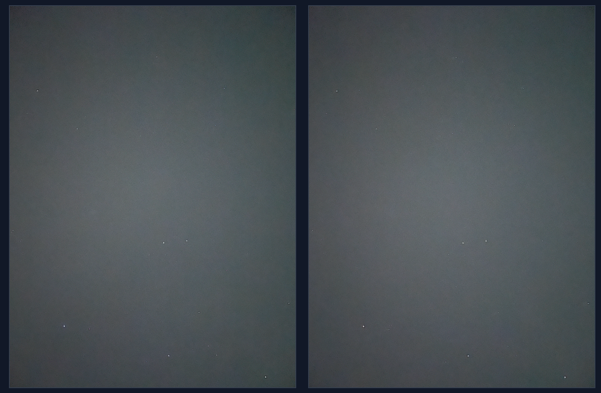
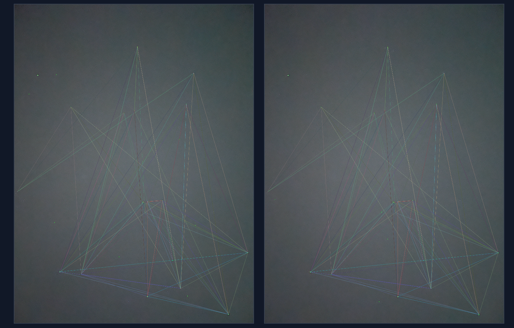
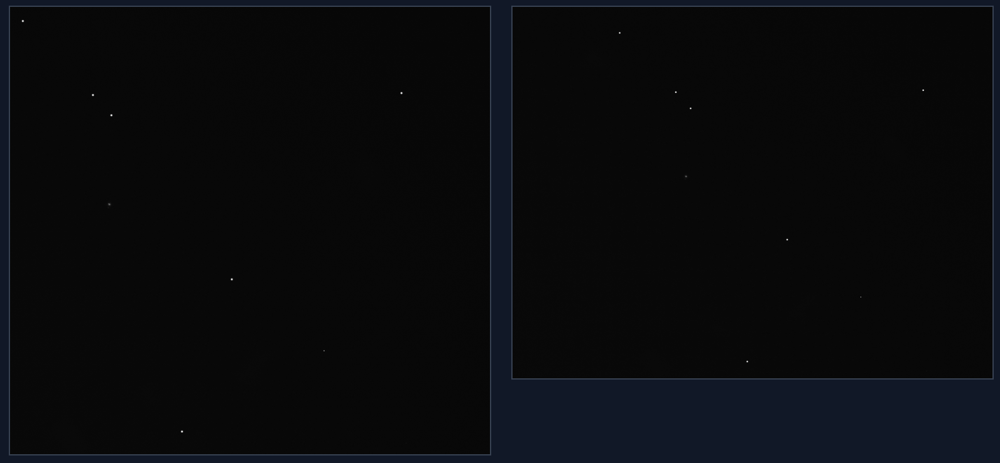
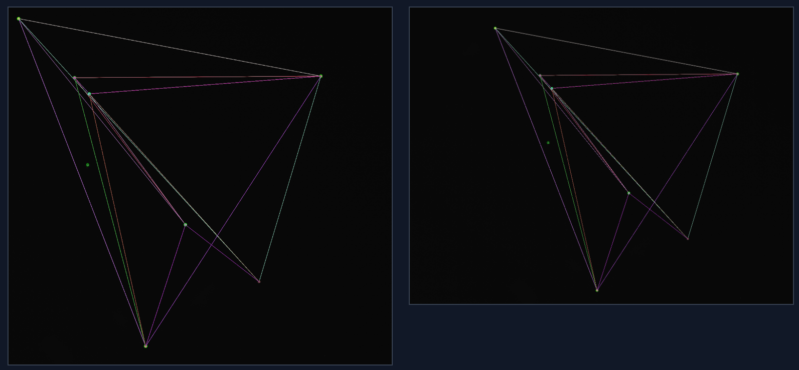

# Summary 
In this assignment, we will develop an algorithm for star classification (identification). Given an image of stars.

You can interact with a demo website here : [Link](https://daniel-naz.github.io)

(Use high gridsize for pictures with a lot of stars and low gridsize for a small amout of stars)

## Part 1 - The Algorithm

The algorithm is based on the following presentation : [Link](https://sites.astro.caltech.edu/~moncelsi/FTS_talk.pdf).

The algorithm follows these steps:
1. 'Split' the images into a grid.
2. Take the 'n' brightest stars in each cell of the grid.
3. Pick 4 random stars and construct a geometric feature with 4 sides (quadrilateral).

   The 2 most distant stars are labelled A, B and are used to establish a local coordinate frame.

   The other stars are labelled C, D and they are used to compare 2 shapes.
4. Build 'n' geometric features in each cell.
5. Compare the features from the 2 images.

## Part 2 - Star Identification

We convert the image to grayscale and calculate the radius and brightness of the star.

## Part 3 - Star Matching 

Here we use the algorithm talked about it Part 1, we first split the image into cells and build geometric features.

## Part 4 - Conclusion

The method we used can identify most stars but can also miss some of them depending on the grid size and thresholds. The user
needs to balace the runtime with the accuracy of the match. 

