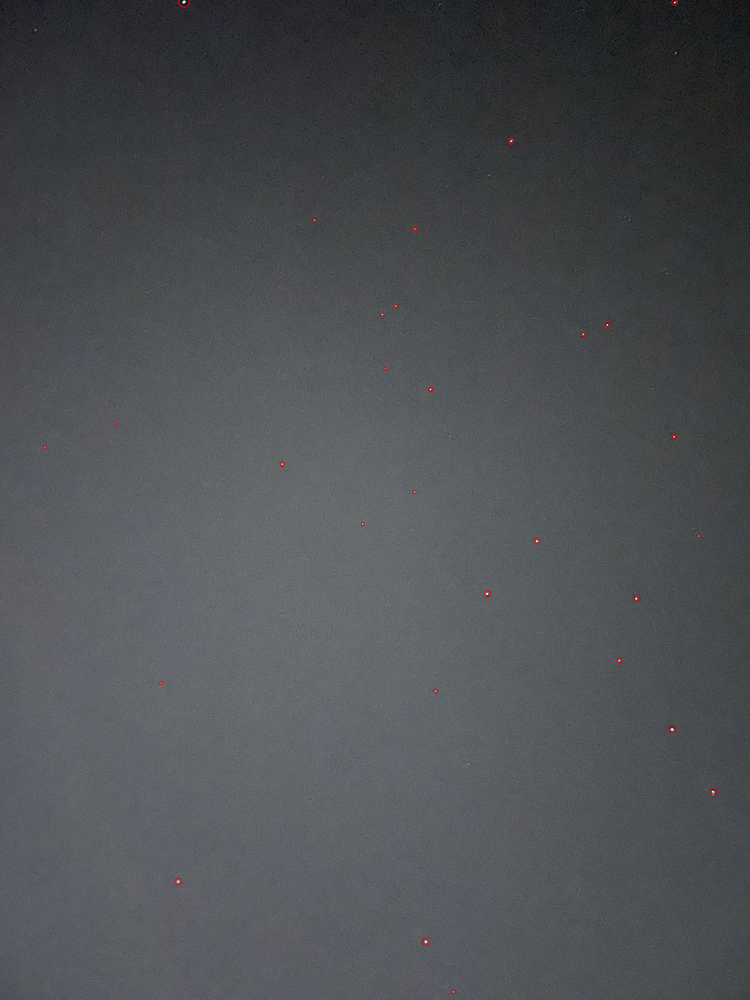

## Part 1 + Part 2 - Identifing Stars

We want to identify stars in an image.

The stars are the brightest objects in the night sky, by converting the input picture to grayscale we can identify the brightest pixeles, their location and their radius.


Finding stars is as simple as looping for every (x, y) until we find a value over some threshold. When we find a star at (x, y) we flood fill every connected
bright pixel, by calculating the distance between each one and storing the maximum we can find the radius of the star. Calculating the brightness is as 
simple as taking the average of all the brightness values.

Circling the result of the finiding algorithm we get:



## Part 3 - Finding Corresponding Stars

We want to find pairs of points (x, y, radius, brightness) that point to the same star.

Bright stars have a higher chance to show on both photos, we take them and build a graph between all of them. Here is an exmple for 2 images of stars, only one
of them is rotated by 180 degrees:


After constructing the graph we can compare the length/angle between each node, the point of this is to find 2 stars we can know for sure the correspond to each other.
After that we can calculate how much we need to transform each stars poision/rotation/scale from image1 to match image2.

We select the brightest stars from each picture and iterate through the graphs until we find a matching line using angles only.


After finiding a line with enough matching angles we make sure using the ratio between the lengths of each conencted child line, example on zoom in image:


After finding 2 lines that probably match, we can calculate the transfrom, example for the lines above (from the left image to right image):

```
transform =  {
    'scale': 1.2108014753914285,
    'rotation_radians': -3.0485913487861405,
    'rotation_degrees': -174.67141774554096, 
    'origin': (2180, 1413), 
    'translation': (511, 1893)
}
```

# Part 4 - TODO 